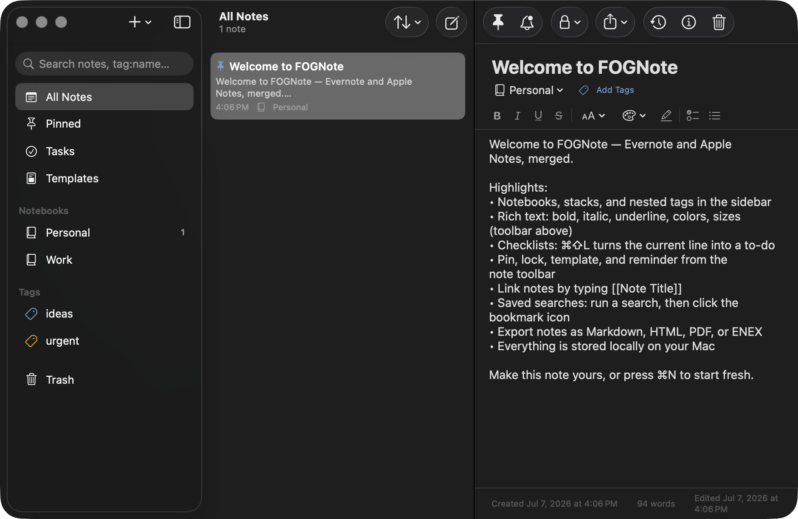

<p align="center">
  
</p>

<h1 align="center">FOGNote</h1>

<p align="center"><b>Evernote × Apple Notes, merged.</b><br>
A native, local-first note-taking app for macOS — the organizational power of Evernote with the simplicity of Apple Notes.</p>



## Features

**From Evernote**
- Notebooks and **stacks** (grouped notebooks)
- Tags with colors, tag-based filtering
- **Saved searches** — run a search, bookmark it to the sidebar
- Evernote search grammar: `tag:name`, `notebook:name`, `intitle:word`, `todo:true`, `created:>2026-01-01`
- Templates — save any note as a template, spawn new notes from it
- Reminders with due dates on any note
- Note **version history** with restore (snapshots on reopen after edits)
- Attachments on any note (any file type, image previews, open/save-as)
- **ENEX export and import** (Evernote's format, checkboxes included)
- Web-clip style source URL field on notes

**From Apple Notes**
- Clean three-pane layout with pinned notes and system-native look
- Rich text editing: bold, italic, underline, strikethrough, sizes, colors, highlight (native macOS 26 `TextEditor` + `AttributedString`)
- Interactive **checklists** (⌘⇧L toggles ☐ → ☑ → off on the current line)
- Per-note **password lock** (salted SHA-256, session unlock)
- Full-text search across titles, bodies, and tags
- Trash with restore and permanent delete
- Everything stored locally — no account, no cloud

**FOGNote extras**
- `[[Note Title]]` wiki-style note links with backlinks panel (Note Info)
- Word/character counts, created/edited timestamps
- Export any note as **Markdown, HTML, PDF, or ENEX**
- Import Markdown, TXT, RTF, HTML, and ENEX (⌘⇧I)

## Install / Build

Requires macOS 26 (Tahoe) and Xcode 26.

```bash
git clone https://github.com/siterepository/FOGNote.git
cd FOGNote
./Scripts/make_app.sh          # builds release + assembles build/FOGNote.app
open build/FOGNote.app
```

Run tests:

```bash
swift test
```

## Architecture

| Layer | Choice |
|---|---|
| UI | SwiftUI, `NavigationSplitView` three-pane |
| Rich text | `TextEditor` + `AttributedString` + `AttributedTextSelection` (macOS 26 APIs) |
| Persistence | SwiftData, store at `~/Library/Application Support/FOGNote/` |
| Body storage | RTF data + plain-text mirror for search |
| Locking | CryptoKit salted SHA-256, session-scoped unlock |
| Packaging | Swift Package executable → `.app` bundle via `Scripts/make_app.sh`, ad-hoc codesigned |

```
Sources/FOGNote/
├── FOGNoteApp.swift          # entry, ModelContainer, commands
├── Models/Models.swift       # Note, Notebook, Stack, Tag, Attachment, NoteVersion, SavedSearch
├── Services/                 # Search grammar, Lock, Export (MD/HTML/PDF/ENEX), Import (+ENEX parser)
├── Views/                    # ContentView, Sidebar, NoteList, NoteDetail, EditorToolbar, accessories
└── Support/                  # AppState, seed data, extensions
```

## Scope notes

Cloud-dependent Evernote/Apple Notes features (sync, real-time collaboration, AI assistant, OCR, audio transcription, web clipper browser extension) are intentionally out of scope for this local-first v1. ENEX import flattens rich formatting to text.

## Brand

Fog palette: primary `#6B9FD4`, secondary `#8B7FB3`, amber `#F59E0B`, lock red `#FF6B6B`. Logo: folded note page emerging from fog bands — `Assets/brand/` has full-color, mono, and app-icon variants.

---
© 2026 FOG. Built with SwiftUI + SwiftData on macOS 26.
